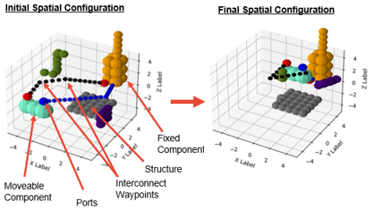

<style>
.center {
  display: block;
  margin-left: auto;
  margin-right: auto;
  width: 50%;
}
</style>

---

[](https://spi2.illinois.edu/)

[](https://github.com/SPI2Py/SPI2Py/actions/workflows/tests.yml)

## Welcome to SPI2py

SPI2 stands for the Spatial Packaging of Interconnected Systems with Physical Interactions.

The SPI2 framework packages components, routes interconnects, and performs multiphysics simulations simultaneously.

At this point in time, we are working on the initial release so many features are missing/untested. We plan to 
demonstrate an early working version by Fall 2023.

## Highlights




## Publications

Satya R T Peddada, Kai A James, James T Allison. 
'A Novel Two-Stage Design Framework for 2d Spatial Packing of Interconnected Components.' 
ASME Journal of Mechanical Design, Dec 2020.
DOI: [10.1115/1.4048817](https://dx.doi.org/10.1115/1.4048817)
```
@article{peddada2021novel,
  title={A novel two-stage design framework for two-dimensional spatial packing of interconnected components},
  author={Peddada, Satya RT and James, Kai A and Allison, James T},
  journal={Journal of Mechanical Design},
  volume={143},
  number={3},
  year={2021},
  publisher={American Society of Mechanical Engineers Digital Collection}
}
```

# How to Install

## Notice

SPI2Py is still early in development and steps to install and contribute are still being worked out. We will update this section as we make progress. 

The instructions below cover setting SPI2Py up on your local machine for development.

## Requirements

SPI2Py is primarily developed in Python 3.10. We recommend using the base Python installation and pip as opposed to environments like Anaconda and SageMath. We also recommend setting up a virtual environment.

## Steps

1. Clone the SPI2Py GitHub repository
2. **Switch from the main branch** to the develop branch (or a feature branch if you are working on a specific feature).
3. Create a virtual environment in the directory
4. Navigate to the top-level directory (e.g., "SPI2py/") and run 
   
   `>>> pip install -e .`

5. Code!

## Cite Us

@software{SPI2py2023github,\
  author = {Chad Peterson},\
  title = {SPI2py: The Spatial Packaging of Interconnected Systems with Physical Interactions},\
  url = {https://github.com/SPI2py/SPI2py},\
  version = {0.0.1},\
  year = {2023},
}

## Sponsors

SPI2py is supported both directly and indirectly through university, government, and industry funding.

This work is supported by the National Science Foundation Engineering Research Center for the Power Optimization of
Electro-Thermal Systems (POETS) with Cooperative Agreement EEC-1449548.

This work is supported by the University of Illinois at Urbana-Champaign Grainger College of Engineering through the
[SPI2 Strategic Research Initiative](https://grainger.illinois.edu/research/sri/spi2).


