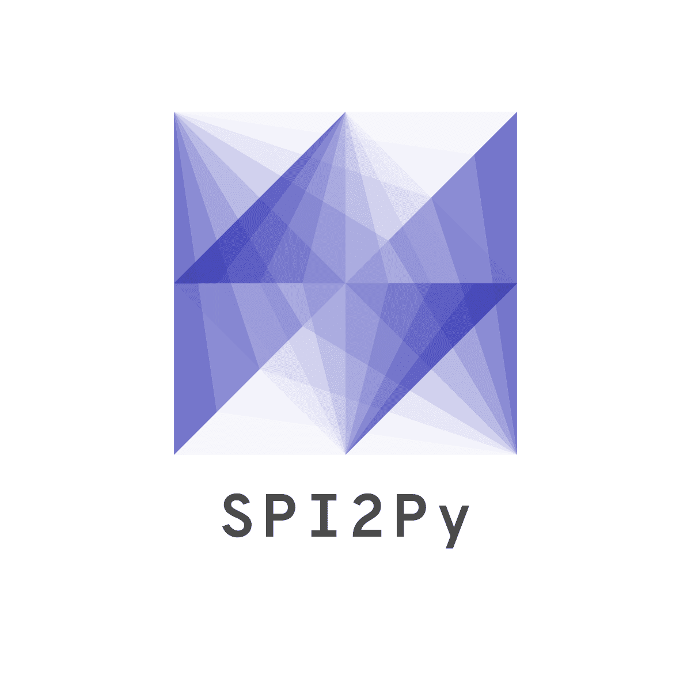

# Welcome to SPI2Py

SPI2 stands for the Spatial Packaging of Interconnected Systems with Physical Interactions.

The SPI2 framework packages components, routes interconnects, and performs multiphysics simulations simultaneously.

At this point in time, we are working on the initial release so many features are missing/untested.

See publications...
